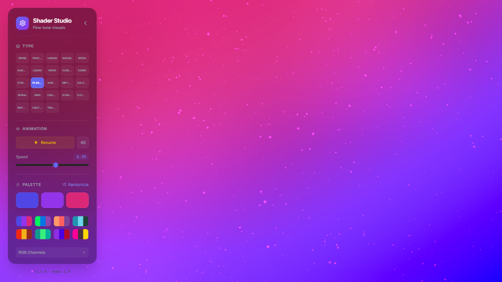

# ✨ Shader Studio - Interactive Procedural Shader Generator

**Shader Studio** is a high-performance, professional-grade interactive web application designed for creating, customizing, and exporting stunning **procedural shaders** and **generative art**. Built with **React**, **Three.js**, and **GLSL**, it offers a powerful suite of tools for artists, developers, and creative coders to explore the intersection of mathematics and visual design.



## 🚀 Features

### 🎨 Advanced Procedural Gradients

Explore 23+ unique gradient types, including:

- **Classic**: Linear, Radial, Mesh, Noise, Fractal.
- **Dynamic**: Aurora, Liquid, Wave, Plasma.
- **Geometric**: Stripes, Voronoi, Grid, Truchet, Kaleidoscope.
- **Advanced**: Metaballs, Caustics, Starfield, Raymarching, Flow Fields.

### 🛠️ Real-time Customization

- **Color Palettes**: Fully customizable 3-color gradients with preset support.
- **Animation Control**: Adjust speed, density, strength, and noise parameters.
- **Visual Corrections**: Fine-tune Hue, Saturation, Brightness, Contrast, Exposure, and Sharpness.
- **Post-Processing**: Add cinematic effects like Vignette, Chromatic Aberration, Glow (with Bloom Threshold), Grain, and Pixelation.
- **Retro Filters**: Apply Scanlines and Color Quantization for a classic look.

### 💾 High-Quality Export

- **GIF Export**: Frame-perfect, seamless loops (Normal or Ping-Pong) with customizable dimensions, FPS, and quality.
- **PNG Export**: Capture high-resolution snapshots of your creations.
- **GLSL Editor**: Direct access to the underlying shader code for advanced users.

### ⚡ Performance & UX

- **GPU Accelerated**: Powered by WebGL and React Three Fiber.
- **Undo/Redo**: Full history support for all parameter changes.
- **Responsive Design**: Sleek, glassmorphic UI that works on desktop and mobile.
- **Particle System**: Integrated background particle system with visibility toggle.

## 🛠️ Tech Stack

- **Frontend**: [React](https://reactjs.org/), [Vite](https://vitejs.dev/)
- **Rendering**: [Three.js](https://threejs.org/), [@react-three/fiber](https://github.com/pmndrs/react-three-fiber)
- **Styling**: [Tailwind CSS](https://tailwindcss.com/), [Lucide React](https://lucide.dev/)
- **Animation**: [Framer Motion](https://www.framer.com/motion/)
- **GIF Encoding**: [gif.js](https://jnordberg.github.io/gif.js/)
- **Language**: [TypeScript](https://www.typescriptlang.org/), [GLSL](<https://www.khronos.org/opengl/wiki/Core_Language_(GLSL)>)

## 📦 Installation

1. **Clone the repository**:

   ```bash
   git clone https://github.com/MuhannedAmged/Shader-Studio.git
   cd shader-studio
   ```

2. **Install dependencies**:

   ```bash
   npm install
   ```

3. **Start the development server**:

   ```bash
   npm run dev
   ```

4. **Build for production**:
   ```bash
   npm run build
   ```

## 📖 Usage

1. **Select a Type**: Choose from the "Type" grid to change the base procedural pattern.
2. **Adjust Colors**: Use the color pickers or randomize to find the perfect palette.
3. **Fine-tune**: Use the sliders to adjust animation and visual parameters.
4. **Post-Process**: Open the "Post-Processing" section to add cinematic filters.
5. **Export**: Click the download icon to save your creation as a GIF or PNG.

## 📄 License

This project is licensed under the MIT License - see the [LICENSE](LICENSE) file for details.

## 🙏 Acknowledgments

- Inspired by the beauty of procedural generation and creative coding.
- Built with the amazing tools from the [Poimandres](https://github.com/pmndrs) ecosystem.

---

## 🏷️ Keywords

`shader-generator` `glsl-editor` `procedural-art` `threejs-react` `webgl-shaders` `generative-design` `creative-coding-tools` `gradient-generator` `animation-design` `gpu-rendering` `vfx-tools` `visual-effects` `mathematical-art` `react-three-fiber` `vite-project` `typescript-shaders` `export-gif-video`
